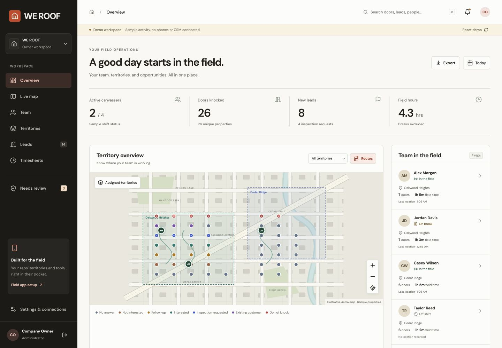

# Validation and pilot checks

## Automated checks

Completed locally: 18 unit tests, all workspace TypeScript checks, dashboard production build, all four Deno endpoint checks, iOS/Android Hermes exports, and the Postgres/PostGIS integration suite passed. A Supabase security-advisor check against the disposable database returned no issues. Production service and physical-phone checks remain required.

- Shared unit tests cover multiple breaks, overnight shifts, invalid transitions, precise clock-out boundaries, DST, day clipping, route gaps, GPS exceptions, lead contact requirements, safe CSV encoding, durable retries, and concurrent capture/sync.
- JobNimbus adapter tests cover expired credentials, failed reads, uncertain creates, duplicate contact matches, and attribution/task payloads.
- Dashboard production build and TypeScript checks run for the dashboard, native app, and shared package.
- Deno typechecks all four backend entrypoints.
- iOS and Android Hermes bundles compile through Expo export.
- The real Postgres/PostGIS migration and integration suite verify idempotency, field boundaries, atomic lead writes, company isolation, rep route isolation, assigned history, owner corrections, deactivation, GPS/territory flags, and stale CRM lease recovery.

The database fixture supplies minimal Supabase Auth roles/functions in an isolated Docker container. Hosted Auth, network realtime delivery, Cron/Vault, and a real JobNimbus account are not exercised by that fixture.

## Browser review

Owner views support demo invites, deactivation/reactivation, boundary drawing/assignment, property histories, do-not-knock clearance, correction approvals, exception reviews, lead retry status, follow-up filtering, CSV downloads, and date/territory/rep filters. Demo mutations stay in localStorage and display a demo-only confirmation. The browser review exercised demo invitations, correction approval, territory drawing/assignment, and CRM retry. Desktop and 390px layouts were checked; the final demo was reset and the browser reported no console errors. Use Reset demo after browser checks.

## Device checks before release

Use one physical iPhone and one representative Android device, not only simulators:

1. Clock in with location permissions enabled. Walk several blocks, lock the screen, and verify fresh owner-map samples and route segments.
2. Start a break, keep walking, then clock out. Verify no new background or map-puck location collection during either period. Verify delayed uploads outside these intervals are rejected.
3. Deny/revoke foreground or background location. Verify clear in-app instructions and unverified GPS flags without losing recorded door work.
4. Force-close/restart the app. Verify the recorded shift resumes accurately and the dashboard shows a stale point/gap while tracking is stopped. Repeat under Android battery-saving settings.
5. Download a small territory, disable cellular/Wi-Fi, record doors/leads/shift events, restart, reconnect, and verify every record appears exactly once.
6. View repeat door history and do-not-knock warnings on a second assigned rep's phone. Verify that rep cannot query another rep's raw locations or contact leads.
7. Deactivate a rep while connected. Verify tracking stops locally after the next account refresh and server requests are refused. Test an offline revocation separately; the phone observes it on reconnection.
8. Test a full morning shift and assess battery usage against your team's real phones. Thirty seconds is an upload target, not an OS guarantee.

## Connected service checks

Create a sandbox homeowner lead and inspection request. Verify contact workflow/status, attribution, office assignee, task type, and requested window in JobNimbus. Repeat the same submission and confirm IDs are reused. Simulate a expired API key and restore it; verify retries. Simulate a timeout after a remote write and verify the job requires reconciliation instead of creating a duplicate.

Confirm invitation/password activation, first-owner access, row policies, realtime publications, Mapbox geocoding, map downloads, Cron delivery, 90-day pruning, and backups in the actual project. Run Supabase advisors on that project after deployment.

## Dependency audit

The verified Expo 57/React Native/Mapbox toolchain currently includes npm advisories in transitive build dependencies, including `braces` and `node-forge`, whose latest registry versions were still reported vulnerable at implementation time. The compatible `xcode` UUID dependency is overridden to 11.1.1. Run `npm audit` before a production build and update through compatible upstream releases; do not apply a force upgrade that breaks the Expo SDK. These advisories do not replace the physical-device and connected-service checks above.
